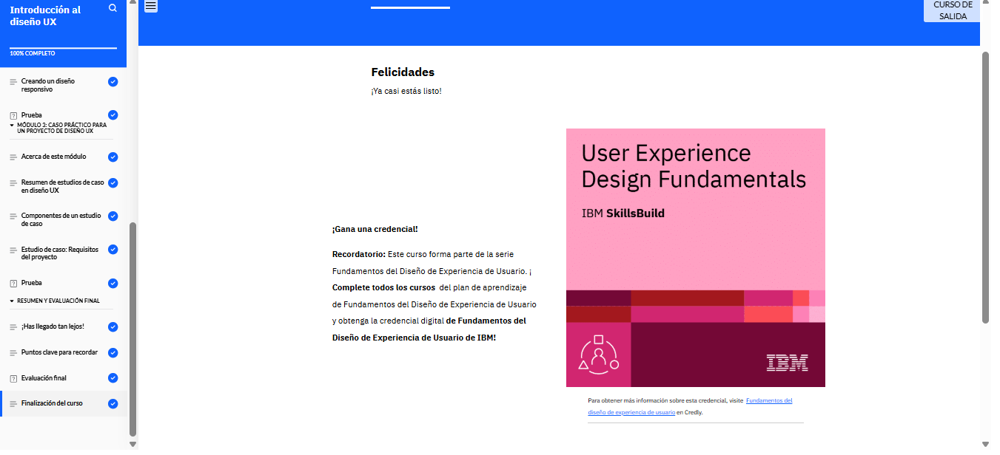

# Introducción al diseño UX

En el curso de Introducción al Diseño de Experiencia de Usuario (UX), aprendí los conceptos básicos del diseño UX, cómo se diferencia del diseño de interfaz (UI) y la importancia del diseño centrado en el usuario (UCD). También comprendí las diferencias entre diseños adaptativos y responsivos y exploré un estudio de caso que me mostró cómo definir los requisitos de un proyecto UX.

<!--  -->
