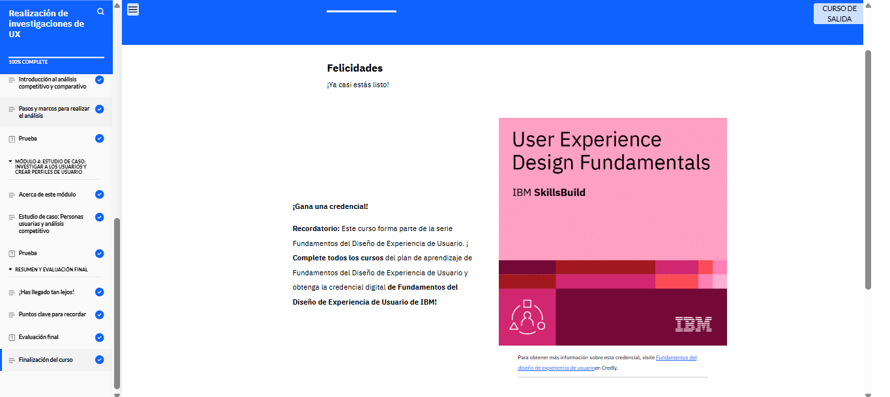

# Realización de investigaciones de UX

En el módulo 2 del curso de Investigación en UX, aprendí la importancia de la investigación para crear un diseño centrado en el usuario. Exploré métodos y técnicas de investigación UX, el valor de las personas de usuario y cómo crearlas a partir de los datos recopilados. También comprendí cómo realizar un análisis competitivo y comparativo para evaluar un producto frente a sus competidores. Finalmente, revisé un estudio de caso que mostró cómo investigar usuarios y crear personas para un e-commerce de venta de plantas.

<!--  -->