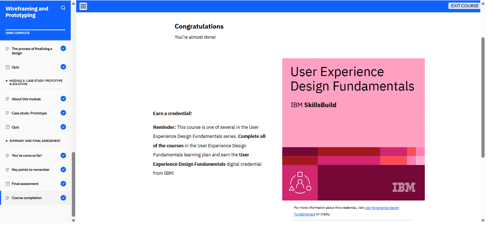

# Wireframing y creación de prototipos

En el módulo 4 del curso de Wireframing y Prototipado, aprendí sobre la redacción UX, la arquitectura de la información (IA) y la creación de sitemaps para organizar el contenido de un producto digital. Exploré el proceso de wireframing, sus tres tipos y su importancia en el diseño UX. También comprendí los principios clave del diseño de interfaz (UI) y cómo mejorar la accesibilidad. Finalmente, estudié el proceso de prototipado y revisé un estudio de caso de un e-commerce de venta de plantas, aplicando estos conceptos para crear diseños y prototipos efectivos.

<!--  -->