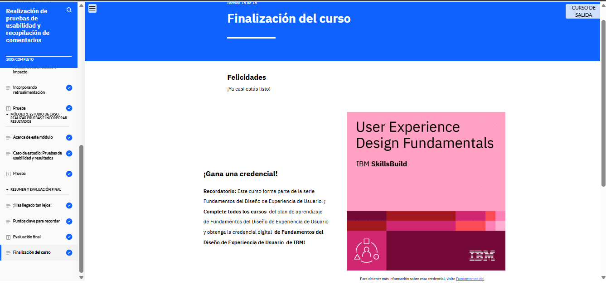

# Realización de pruebas de usabilidad y recopilación de comentarios

En el módulo 5 del curso de Pruebas de Usabilidad y Recopilación de Retroalimentación, aprendí cómo los diseñadores UX evalúan sus diseños mediante pruebas de usabilidad. Exploré los métodos cualitativos y cuantitativos para realizarlas, el proceso paso a paso y la evaluación heurística. También comprendí cómo priorizar los problemas usando los niveles de gravedad y la matriz de impacto-esfuerzo. Finalmente, revisé un estudio de caso de un e-commerce de venta de plantas, donde analicé un plan de prueba, el informe de análisis y un prototipo revisado basado en la retroalimentación obtenida.

<!--  -->