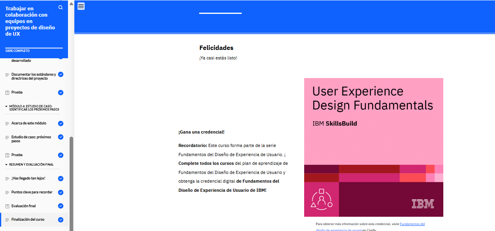

# Trabajar en colaboración con equipos en proyectos de diseño de UX

En el módulo 6 del curso de Colaboración con Equipos en Proyectos de Diseño UX, aprendí sobre los equipos multifuncionales, sus beneficios y los roles dentro de un proyecto de diseño UX. Exploré las mejores prácticas de comunicación y colaboración, la importancia de la interacción entre los diseñadores y los desarrolladores, y los artefactos de diseño que se entregan para el desarrollo. También comprendí cómo revisar un producto digital ya desarrollado. Finalmente, analicé un estudio de caso de un e-commerce de venta de plantas, identificando los miembros del equipo, sus métodos de colaboración y el proceso de revisión del producto final.

<!--  -->