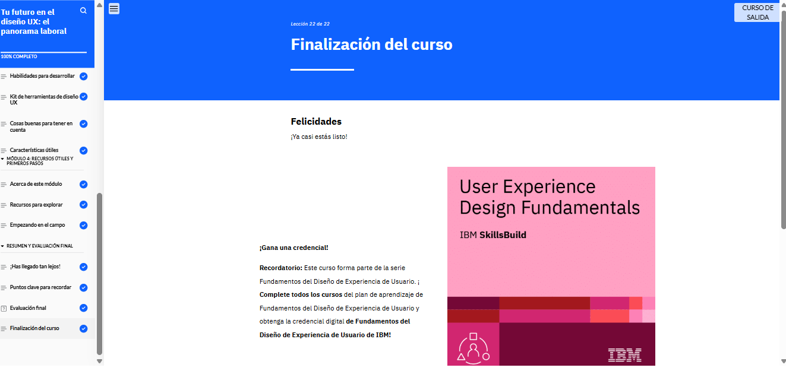

# Tu futuro en el diseño UX: el panorama laboral

En el módulo 7 del curso Tu Futuro en el Diseño UX: El Panorama Laboral, aprendí sobre la demanda global de diseñadores UX y las industrias en las que pueden trabajar. Exploré las responsabilidades principales de un diseñador UX, las habilidades esenciales para tener éxito y cómo se diferencian de otros tipos de diseñadores. Además, conocí recursos y oportunidades de aprendizaje para seguir actualizándome en el campo del diseño UX.

<!--  -->